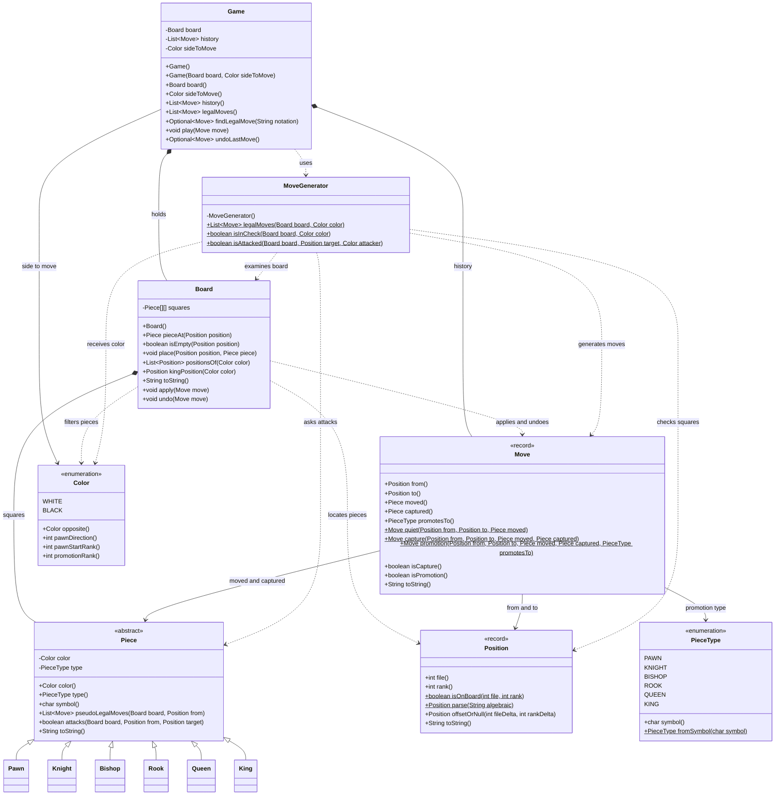
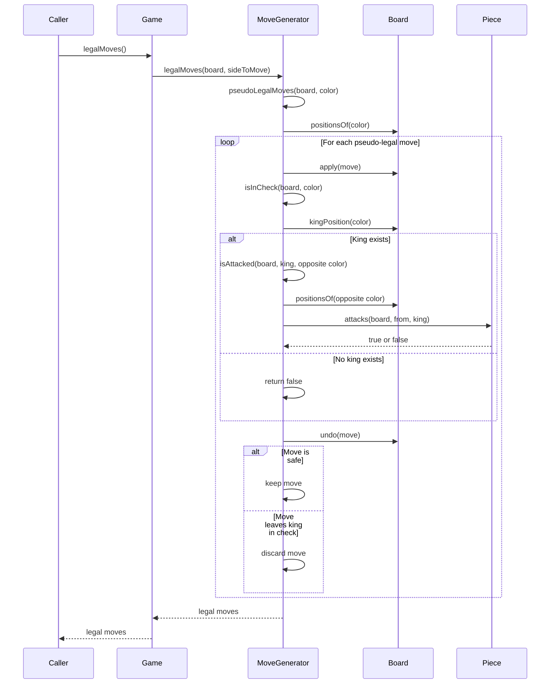

# Chess Engine Design

## Class diagram

```mermaid
classDiagram
    class Game {
        -Board board
        -List~Move~ history
        -Color sideToMove
        +Game()
        +Game(Board board, Color sideToMove)
        +Board board()
        +Color sideToMove()
        +List~Move~ history()
        +List~Move~ legalMoves()
        +Optional~Move~ findLegalMove(String notation)
        +void play(Move move)
        +Optional~Move~ undoLastMove()
    }

    class MoveGenerator {
        -MoveGenerator()
        +List~Move~ legalMoves(Board board, Color color)$
        +boolean isInCheck(Board board, Color color)$
        +boolean isAttacked(Board board, Position target, Color attacker)$
    }

    class Board {
        -Piece[][] squares
        +Board()
        +Piece pieceAt(Position position)
        +boolean isEmpty(Position position)
        +void place(Position position, Piece piece)
        +List~Position~ positionsOf(Color color)
        +Position kingPosition(Color color)
        +String toString()
        +void apply(Move move)
        +void undo(Move move)
    }

    class Piece {
        <<abstract>>
        -Color color
        -PieceType type
        +Color color()
        +PieceType type()
        +char symbol()
        +List~Move~ pseudoLegalMoves(Board board, Position from)
        +boolean attacks(Board board, Position from, Position target)
        +String toString()
    }

    class Pawn
    class Knight
    class Bishop
    class Rook
    class Queen
    class King

    class Move {
        <<record>>
        +Position from()
        +Position to()
        +Piece moved()
        +Piece captured()
        +PieceType promotesTo()
        +Move quiet(Position from, Position to, Piece moved)$
        +Move capture(Position from, Position to, Piece moved, Piece captured)$
        +Move promotion(Position from, Position to, Piece moved, Piece captured, PieceType promotesTo)$
        +boolean isCapture()
        +boolean isPromotion()
        +String toString()
    }

    class Position {
        <<record>>
        +int file()
        +int rank()
        +boolean isOnBoard(int file, int rank)$
        +Position parse(String algebraic)$
        +Position offsetOrNull(int fileDelta, int rankDelta)
        +String toString()
    }

    class Color {
        <<enumeration>>
        WHITE
        BLACK
        +Color opposite()
        +int pawnDirection()
        +int pawnStartRank()
        +int promotionRank()
    }

    class PieceType {
        <<enumeration>>
        PAWN
        KNIGHT
        BISHOP
        ROOK
        QUEEN
        KING
        +char symbol()
        +PieceType fromSymbol(char symbol)$
    }

    Piece <|-- Pawn
    Piece <|-- Knight
    Piece <|-- Bishop
    Piece <|-- Rook
    Piece <|-- Queen
    Piece <|-- King

    Game *-- Board : holds
    Game *-- Move : history
    Game --> Color : side to move
    Game ..> MoveGenerator : uses

    Board *-- Piece : squares
    Board ..> Position : locates pieces
    Board ..> Color : filters pieces
    Board ..> Move : applies and undoes

    Move --> Position : from and to
    Move --> Piece : moved and captured
    Move --> PieceType : promotion type

    MoveGenerator ..> Board : examines board
    MoveGenerator ..> Color : receives color
    MoveGenerator ..> Move : generates moves
    MoveGenerator ..> Position : checks squares
    MoveGenerator ..> Piece : asks attacks
```

## Sequence diagram: `game.legalMoves()`

```mermaid
sequenceDiagram
    participant Caller
    participant Game
    participant MoveGenerator
    participant Board
    participant Piece

    Caller->>Game: legalMoves()
    Game->>MoveGenerator: legalMoves(board, sideToMove)
    MoveGenerator->>MoveGenerator: pseudoLegalMoves(board, color)
    MoveGenerator->>Board: positionsOf(color)

    loop For each pseudo-legal move
        MoveGenerator->>Board: apply(move)
        MoveGenerator->>MoveGenerator: isInCheck(board, color)
        MoveGenerator->>Board: kingPosition(color)

        alt King exists
            MoveGenerator->>MoveGenerator: isAttacked(board, king, opposite color)
            MoveGenerator->>Board: positionsOf(opposite color)
            MoveGenerator->>Piece: attacks(board, from, king)
            Piece-->>MoveGenerator: true or false
        else No king exists
            MoveGenerator->>MoveGenerator: return false
        end

        MoveGenerator->>Board: undo(move)

        alt Move is safe
            MoveGenerator->>MoveGenerator: keep move
        else Move leaves king in check
            MoveGenerator->>MoveGenerator: discard move
        end
    end

    MoveGenerator-->>Game: legal moves
    Game-->>Caller: legal moves
```
